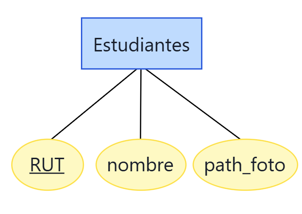
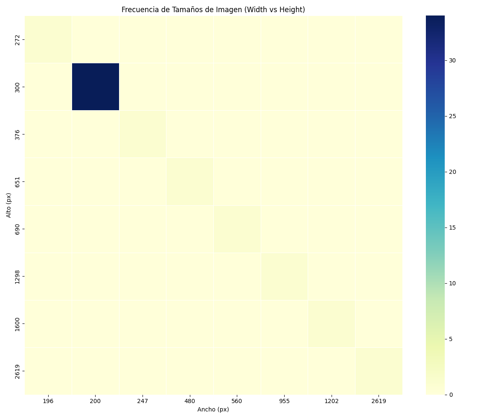
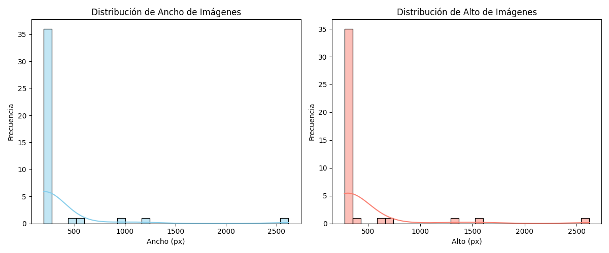
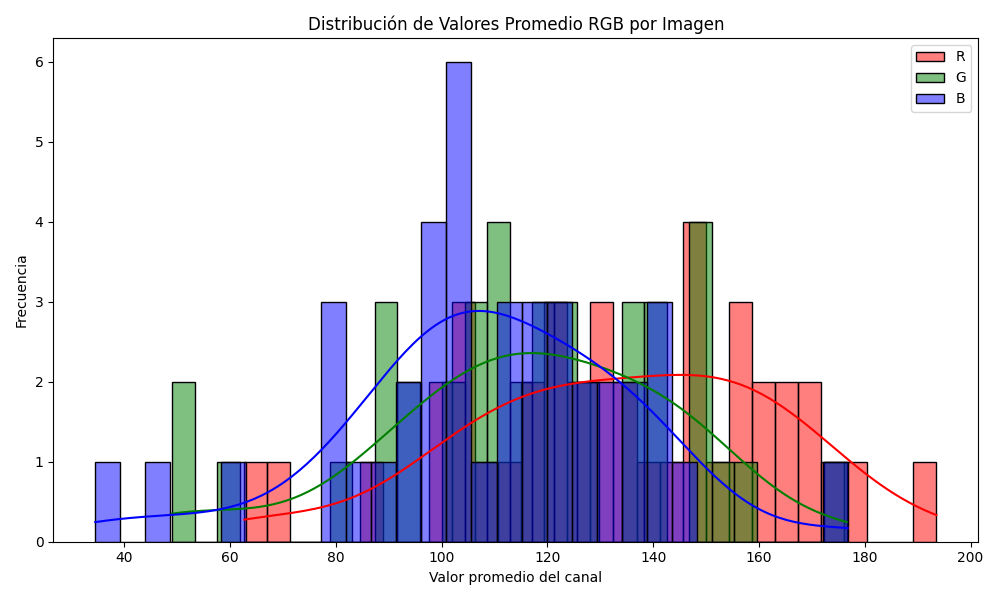

# FaceGate

Este proyecto consiste en la implementación de un nuevo sistema de control de acceso para estudiantes de la Facultad de Ciencias Físicas y Matemáticas de la Universidad de Chile. 

Mediante una cámara web, se realiza reconocimiento facial comparando la imagen capturada en tiempo real con la imagen almacenada en Ucampus (una base de datos acotada y recopilada por nosotros). 

La imagen de referencia de Ucampus se obtiene cuando el estudiante ingresa su rut. Luego, el sistema toma la imagen en vivo, obtiene embeddings mediante el modelo VGGFace2 (específicamente InceptionResnetV1), y realiza la comparación 1 a 1 para validar su identidad.

---

## Arquitectura

### Base de Datos Ucampus

La base de datos de Ucampus utilizada es una versión reducida creada para este proyecto. 

- Contiene 41 personas.
- Cada persona está representada por una única imagen.

La estructura de la base de datos se ilustra en el siguiente diagrama:

---

### Backend

El backend está desarrollado en Flask y usa el modelo InceptionResnetV1 preentrenado con VGGFace2 para extraer embeddings faciales.

---

## Análisis Exploratorio de Datos (EDA)

Se realizó un análisis exploratorio sobre las 51 imágenes iniciales de la base de datos Ucampus para entender mejor sus características.

### Dimensiones de las imágenes

Se observó que la mayoría de imágenes se encuentre entre los 200-250 píxeles de ancho y 300 píxeles de alto.

### Análisis de canales RGB

Los valores RGB para cada imagen presentan una distribución aproximadamente binomial en cada canal de color, concentrándose mayormente en el rango de 80 a 160. Esto indica que los tonos medios son predominantes en las imágenes de la base de datos, lo que sugiere una iluminación relativamente uniforme y ausencia de regiones extremadamente oscuras o saturadas.

Además, se observa que el canal rojo es el único que frecuentemente sobrepasa este rango, desplazando su distribución hacia valores más altos. Esto podría deberse a la predominancia de tonos cálidos en las imágenes o a las características específicas del entorno de captura.

Por otro lado, no suelen encontrarse valores atípicos en los histogramas, como picos en 0 (negro absoluto) o 255 (blanco saturado). La ausencia de estos valores extremos indica que las imágenes rara vez contienen zonas totalmente negras o saturadas, lo que evita pérdidas de información y sugiere una buena calidad en la captura y preprocesamiento. Estos valores atípicos podrían indicar problemas de iluminación, sombras muy marcadas o sobreexposición, pero en este caso se minimizan, favoreciendo la consistencia del modelo durante el entrenamiento y la inferencia.

---

## Referencias

- **VGGFace2 (ResNet-50)**  
  ArXiv paper: [https://arxiv.org/abs/1710.08092](https://arxiv.org/abs/1710.08092)

- **How to Perform Face Recognition With VGGFace2 in Keras**  
  Tutorial: [https://machinelearningmastery.com/how-to-perform-face-recognition-with-vggface2-convolutional-neural-network-in-keras](https://machinelearningmastery.com/how-to-perform-face-recognition-with-vggface2-convolutional-neural-network-in-keras/#:~:text=The%20VGGFace%20refers%20to%20a%20series%20of%20models,Geometry%20Group%20%28VGG%29%20at%20the%20University%20of%20Oxford)

- **Face Recognition using Tensorflow (Inception-ResNet-v1 model)**  
  GitHub repo: [https://github.com/davidsandberg/facenet](https://github.com/davidsandberg/facenet)

- **VGGFace2 Trained Models**  
  GitHub repo: [https://github.com/ox-vgg/vgg_face2](https://github.com/ox-vgg/vgg_face2)
