# FACEGATE - CC6409 Taller de Proyecto de IA

Este repositorio contiene el proyecto final desarrollado durante el curso **CC6409: Taller de Proyecto de IA**, dictado por el profesor **Juan Manuel Barrios** en la **Facultad de Ciencias Físicas y Matemáticas de la Universidad de Chile**.

**FaceGate** es un sistema de control de acceso para estudiantes, basado en **reconocimiento facial**, que busca mejorar la seguridad de ingreso a la facultad mediante una cámara web y validación contra imágenes preexistentes en una base de datos simulada de **Ucampus**.

---

## 🎯 Objetivo

El sistema permite validar la identidad de un estudiante a través del ingreso de su **RUT** y una captura en tiempo real de su rostro en casos de pérdida de la TUI (Tarjeta de Ingreso a la Universidad). Esta imagen es comparada con los **embeddings faciales** almacenados, usando un modelo de **red neuronal convolucional preentrenado** sobre **VGGFace2** (InceptionResnetV1). La decisión de acceso se basa en la **distancia coseno** entre embeddings y un umbral definido empíricamente.

---

## 🏗️ Arquitectura General

### Base de Datos Ucampus

La base de datos utilizada simula el sistema de Ucampus y contiene:
- 41 estudiantes, cada uno con una imagen oficial.
- Embeddings de hasta 6 imágenes por estudiante (1 oficial y hasta 5 capturas recientes).

📌 Diagrama ER:
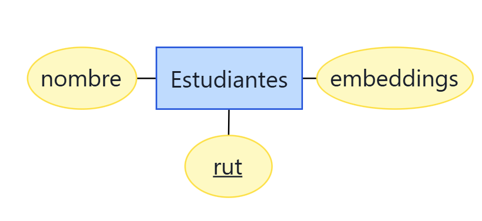

---

## 📊 Análisis Exploratorio de Datos

Se realizó un EDA sobre las imágenes de la base de datos para evaluar su calidad y consistencia. Entre los hallazgos más relevantes:

- La mayoría de las imágenes tienen entre 200–250px de ancho y 300px de alto.
- Los canales RGB tienen una distribución balanceada, sin extremos (blanco o negro), lo que sugiere buena iluminación general.
- El canal rojo tiende a concentrar valores más altos, posiblemente por tonos cálidos en el entorno.

📷 Dimensiones:
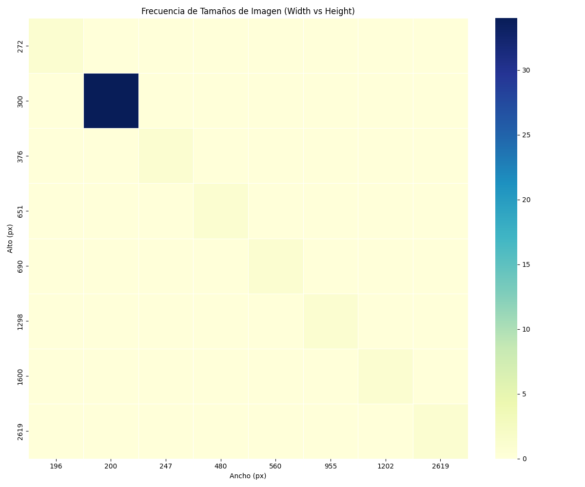
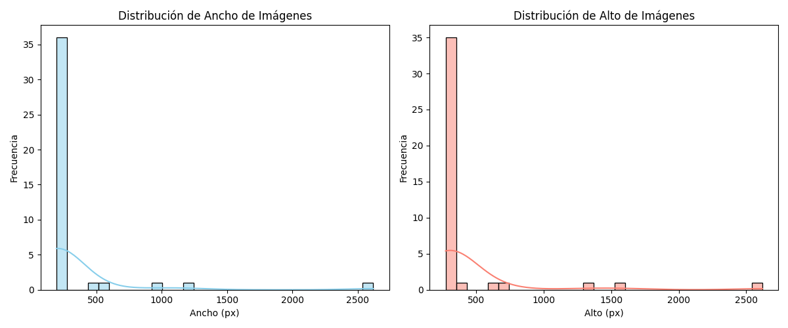

🌈 Análisis RGB:
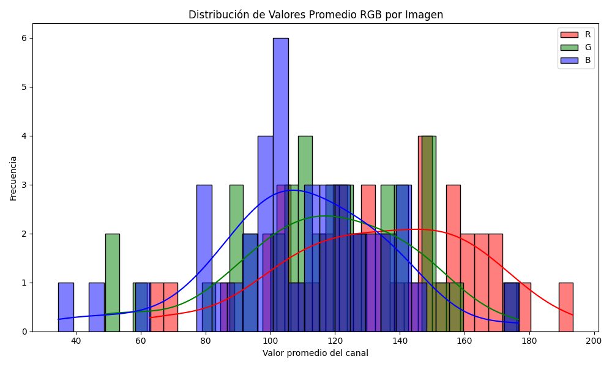

---

## 🧠 Backend: Reconocimiento Facial

El backend fue implementado con **Flask** y es el responsable de procesar imágenes, comparar rostros y registrar intentos de acceso. Usa modelos de deep learning para verificar la identidad facial de los/as estudiante en tiempo real.

---

### 🛠 Tecnologías

- **Flask**: API REST y servidor WebSocket.
- **Facenet (InceptionResnetV1) + MTCNN**: Extracción de embeddings faciales.
- **PyTorch**: Cálculo de distancias y procesamiento tensorial.
- **MySQL**: Almacenamiento de usuarios, embeddings y logs.
- **Flask-SocketIO**: Comunicación en tiempo real con el frontend.

---

### 📂 Estructura del backend

| Módulo                        | Descripción                                                 |
|------------------------------|-------------------------------------------------------------|
| `main.py`, `app.py`          | Inicializan la app Flask, rutas REST y WebSocket.           |
| `services/recognition.py`    | Lógica de verificación facial y cálculo de distancias.      |
| `models/embeddings.py`       | Obtención y actualización de embeddings desde imágenes.     |
| `models/distances.py`        | Funciones para distancia del coseno y euclidiana.           |
| `models/face_model.py`       | Carga de modelos preentrenados.                             |
| `services/database.py`       | Acceso a base de datos: usuarios, embeddings, logs.         |
| `utils/file_ops.py`          | Manejo de imágenes: guardado, copia y limpieza.             |
| `services/socket_events.py`  | Emisión de eventos WebSocket con resultados.                |

---

### 🔁 Flujo de verificación

1. El estudiante ingresa su RUT y captura su fotografía. El backend recibe ambos datos (imagen y RUT) enviados desde el frontend.
2. Se extrae el **embedding** facial usando el modelo.
3. Se compara con:
   - La imagen oficial (`db`)
   - Las últimas imágenes recientes del usuario
4. Se aplica una verificación ponderada:
   - **70%** imagen oficial (`db`)
   - **30%** promedio de imágenes recientes
5. Si la **distancia del coseno ponderada** es menor a `0.35`, el acceso es exitoso.
6. El intento se registra en la base de datos y se emite el resultado vía **WebSocket** a las vistas del estudiante y del guardia.

📌 Diagrama:
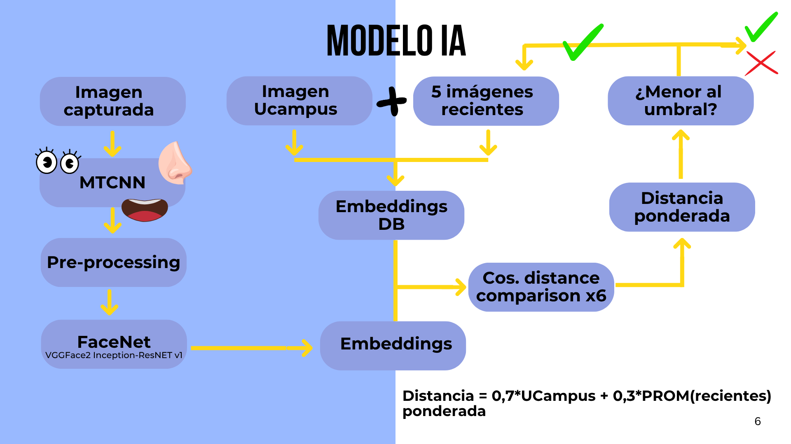

---

## 📏 Umbral de Comparación

Se evaluaron múltiples umbrales (0.00–0.50) con incrementos de 0.05. Los resultados mostraron:

- **0.40**: Mayor tasa de verdaderos positivos (TP), pero presencia de falsos positivos (FP).
- **0.35**: Disminución de FP a 0, manteniendo buena tasa de TP.

🔍 Comparaciones:
- 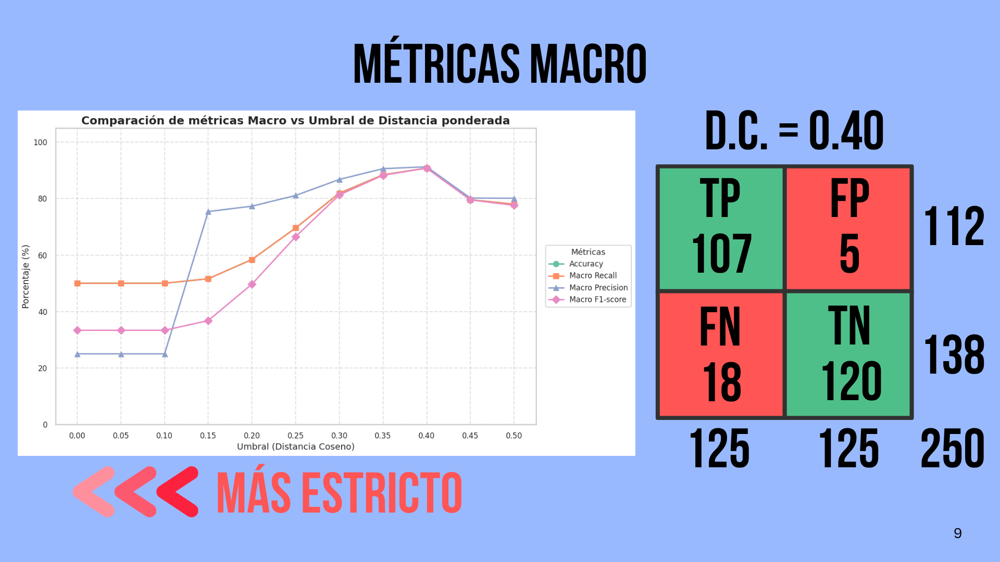
- 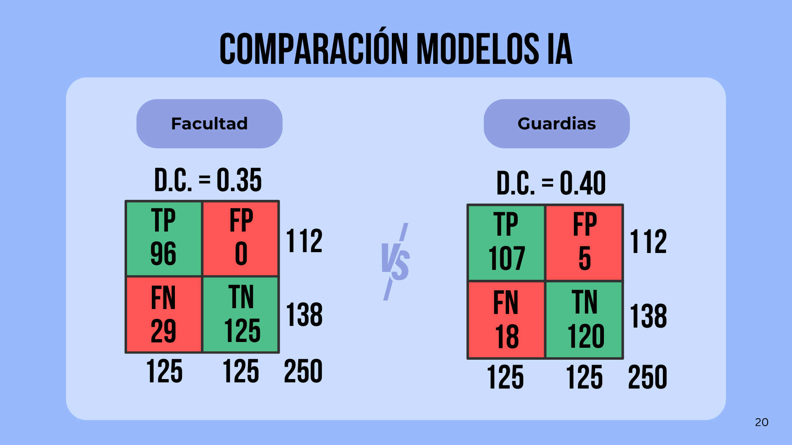

---

## 🌐 Aplicación Web

El sistema cuenta con dos vistas principales:

- **Vista Guardia**: Para supervisar el acceso de estudiantes.
- **Vista Estudiante**: Para ingresar el RUT y capturar imagen.

### Vistas de la aplicación:

👮 Guardia:  
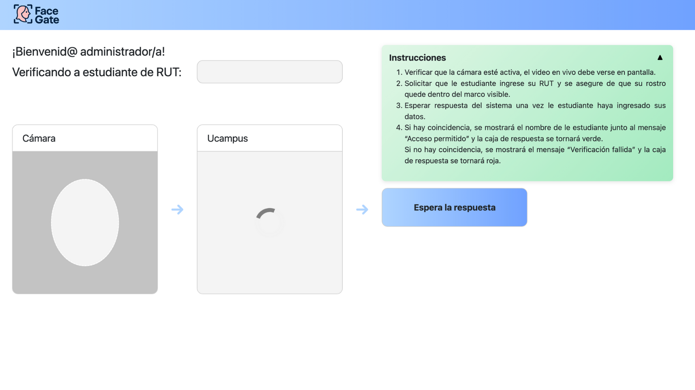

🎓 Estudiante:  
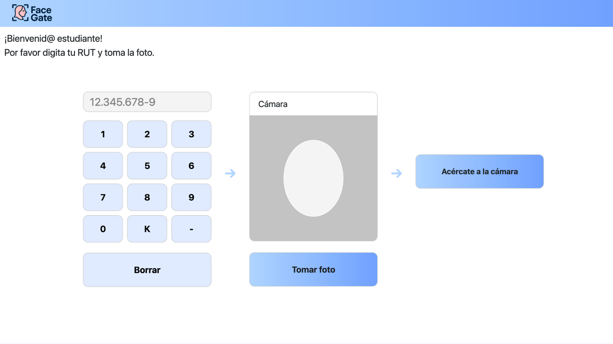

### Mensajes de resultado:
- TP: 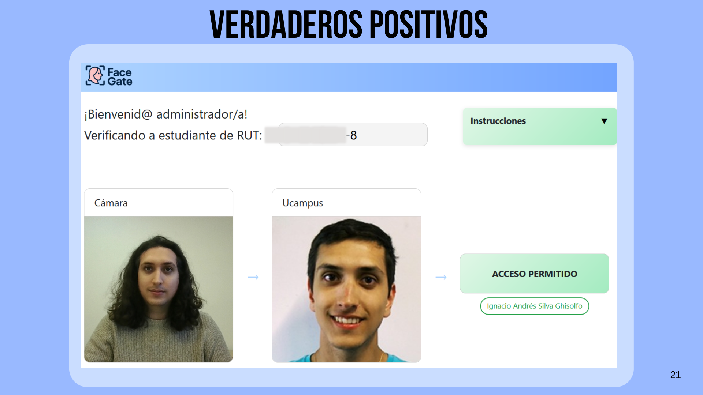
- TN: 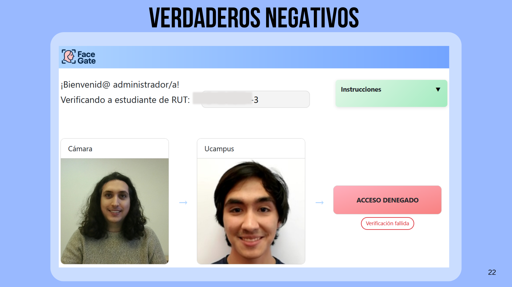
- FN: 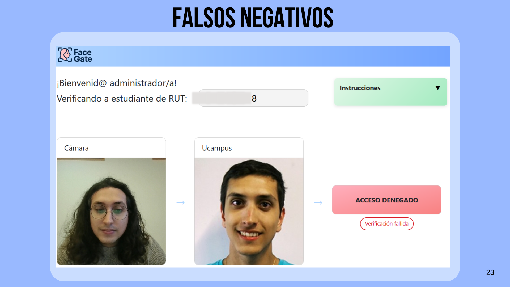
- FP (0.40): 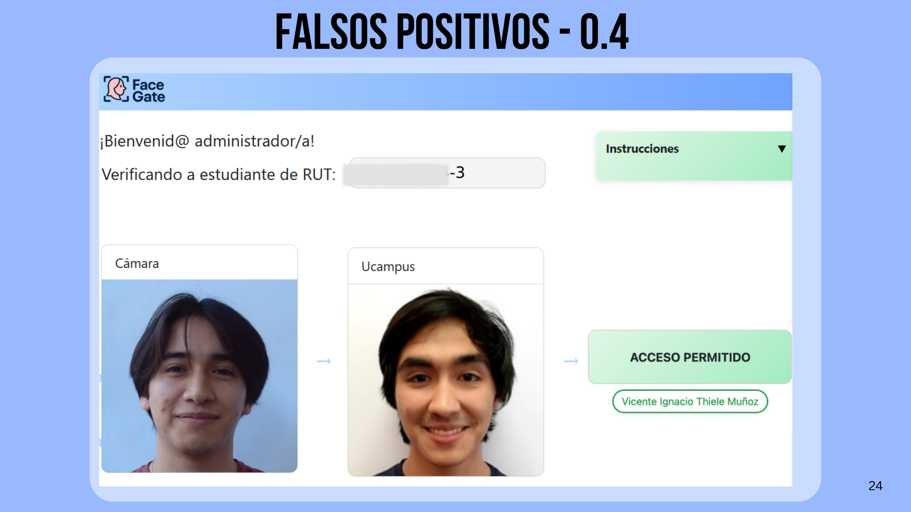
- FP (0.35): 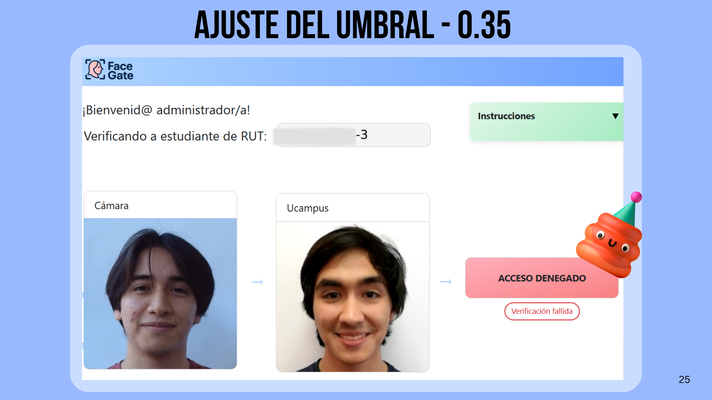

---

## Trabajo Futuro

Existen diversas oportunidades de mejora para el sistema desarrollado, tanto en términos de precisión del modelo como en aspectos éticos y de manejo de datos biométricos. En particular, el uso de embeddings en lugar de imágenes no garantiza por sí solo la seguridad de la información biométrica, por lo que se plantea la incorporación de técnicas adicionales de protección, como el cifrado de datos.

Asimismo, se propone escalar el prototipo a un entorno más representativo, integrando una base de datos oficial de la facultad o adaptando el proyecto para el Departamento de Ciencias de la Computación (DCC). Esto permitiría evaluar el desempeño del sistema en condiciones reales y obtener métricas más robustas y generalizables.

---

## 👥 Miembros del Equipo

- Ignacio Silva G. [GitHub](https://github.com/Chileandude)
- Javiera Romero O. [GitHub](https://github.com/javiromeroo)
- Laura Maldonado L. [GitHub](https://github.com/lauraflm)
- Patricio Espinoza A. [GitHub](https://github.com/patricioespinozaa)
- Vicente Thiele M. [GitHub](https://github.com/ElVichoSiu)

---
## 📚 Referencias

- **VGGFace2 (ResNet-50)**  
  Cao, Q., Shen, L., Xie, W., Parkhi, O. M., & Zisserman, A. (2018). *VGGFace2: A dataset for recognising faces across pose and age*. IEEE Conference on Automatic Face and Gesture Recognition (F&G). Recuperado de https://arxiv.org/abs/1710.08092

- **How to Perform Face Recognition With VGGFace2 in Keras**  
  Brownlee, J. (2020, August 24). *How to perform face recognition with VGGFace2 in Keras*. Machine Learning Mastery. Recuperado de https://machinelearningmastery.com/how-to-perform-face-recognition-with-vggface2-convolutional-neural-network-in-keras

- **FaceNet - InceptionResnetV1 implementation**  
  Sandberg, D. (2018, March 4). *Face Recognition using Tensorflow* [Repositorio GitHub]. Recuperado de https://github.com/davidsandberg/facenet

- **VGGFace2 Trained Models (PyTorch)**  
  Visual Geometry Group, University of Oxford (VGG@Oxford). (2019, December 5). *VGGFace2 Dataset for Face Recognition* [Repositorio GitHub]. Recuperado de https://github.com/ox-vgg/vgg_face2

---